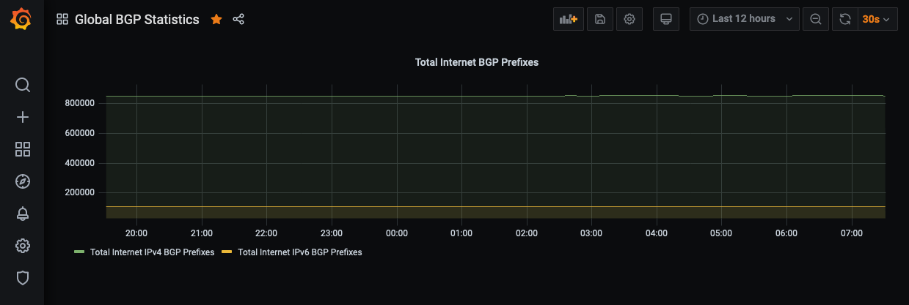

# Internet BGP Dashboard

## Requirements
- `docker-compose`
- `docker`

## Setup
- [ ] clone: `git clone https://github.com/jtdub/internet-bgp-dashboard.git`
- [ ] enter directory: `cd internet-bgp-dashboard`
- [ ] spin up: `docker-compose up`
- [ ] access: `http://localhost:3000`
  * username: `admin`
  * password: `admin`
